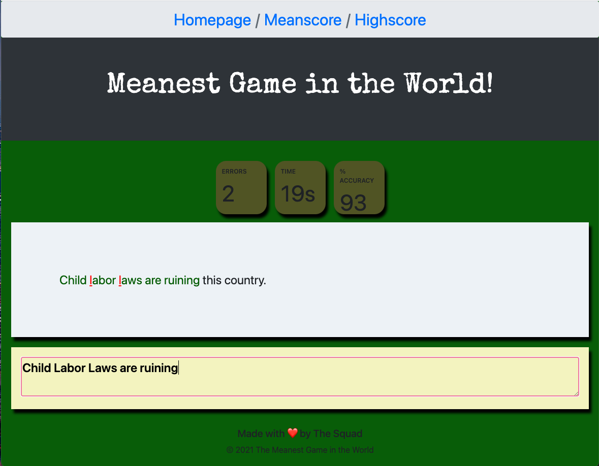
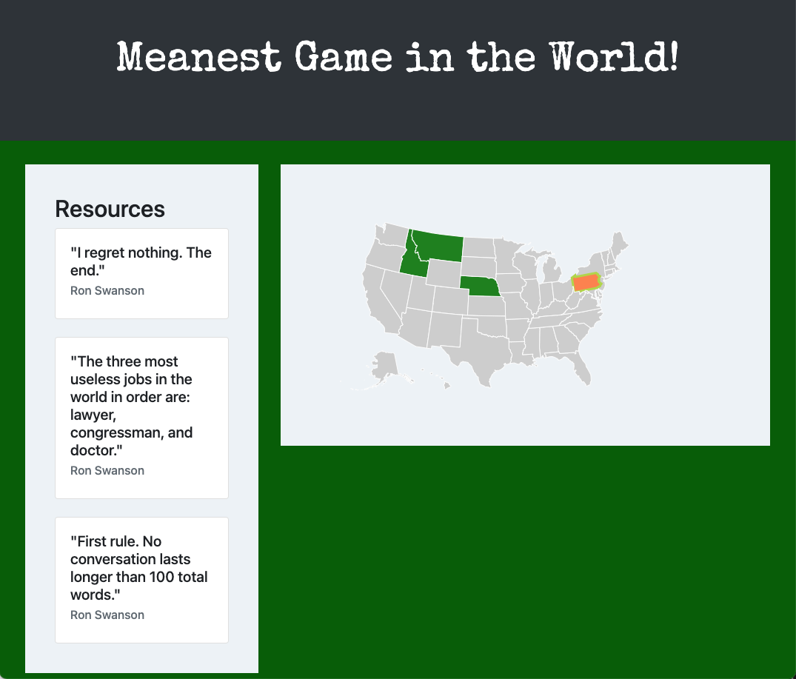

### Description
This is the Meanest Game in the World app. This app was created through a collaborative efforts of three web developers using Bootstrap, Sequelize, MySQL, Express, Express Handlebars, Google fonts and two APIs. The Two API's used are: Ron Swanson Quotes API and DataMaps API. 

The Meanest Game in the World is an educational typing game testing users for typing speed and accuracy, the user goes on journey to become the ultimate dictator by using the points recieved to take over the world. In the initial MVP the user only has the ability to take over one country. When the user needs resources for taking over an area, they navigate to the “Meanscore” page where a typing accuracy test generates, using random quotes pulled from the Ron Swanson Quotes API. The user will then have to type out the quote as accurate and fast as possible. 
The game ends when the user runs out of time.

In the image below you can see how the app works:

As you can see the random quote populates on the white box and the user can will be prompted try to type same quote as fast and accurate as possible on the yellow box below. As the user is typing a timer will be running at the top of the boxes, once the time is up the results will be shown. If makes a typing mistake the mistake will appear on red, just like the example above. If the user decides to restart the game, they can click on the restart buttom. 

The image below is an example of what the homepage of the app looks like:

The homepage populates the DataMaps API. When the user has enough resources(points) to conquer a new state, the state purchased change colors. If a state is colored green then it means the user has purchased it. If the user hovers over a state the state will appear orange. 

### Contributers
Claudia Hernandez [GitHub Profile](https://github.com/Claudialhc)
 
Travis Ko [GitHub Profile](https://github.com/TechKoSpeaks)
 
Eric Chen [GitHub Profile](https://github.com/EricChen96)

### Links
Heroku Deployed [Link](https://ucsdprojecttwo.herokuapp.com/) 
 
GitHub Repo [Link](https://github.com/TechKoSpeaks/MeanGame.git)